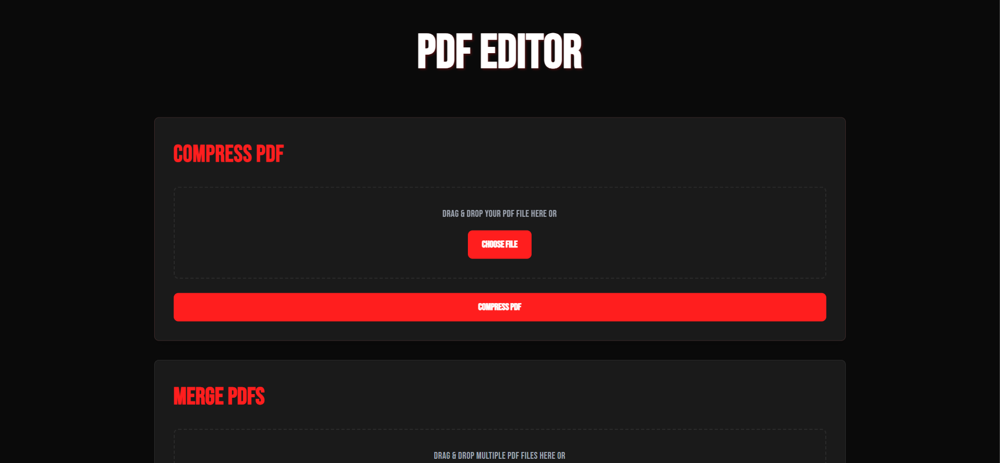

# PDF Editor Web Application

A modern, sleek web application for PDF manipulation with a dark theme and red accents. Built with Flask and modern web technologies, this application provides a user-friendly interface for common PDF operations.



## 🚀 Features

### PDF Compression
- Drag & drop interface for file upload
- Visual feedback during file selection
- Automatic file naming (compressed_filename.pdf)
- In-memory compression without server storage
- Support for large PDF files (up to 16MB)

### PDF Merger
- Multiple file upload support
- Interactive drag & drop reordering
- Visual position indicators
- File name preview
- Maintains original PDF quality
- Delete individual files from merge list

## 💻 Tech Stack

### Frontend
- HTML5 with modern semantic elements
- Tailwind CSS for styling
- Bebas Neue font for typography
- Font Awesome icons
- Vanilla JavaScript with modern ES6+ features
- Drag & Drop API implementation

### Backend
- Python 3.x
- Flask web framework
- PyPDF2 for PDF manipulation
- Werkzeug for file handling
- In-memory file processing

## 🛠️ Installation

1. Clone the repository:
```bash
git clone https://github.com/apih99/pdf-editor.git
cd pdf-editor
```

2. Create a virtual environment (recommended):
```bash
python -m venv venv
# On Windows
venv\Scripts\activate
# On macOS/Linux
source venv/bin/activate
```

3. Install dependencies:
```bash
pip install -r requirements.txt
```

4. Run the application:
```bash
python app.py
```

5. Open your browser and navigate to:
```
http://localhost:5000
```

## 📝 Usage

### Compressing PDFs
1. Navigate to the "COMPRESS PDF" section
2. Either drag & drop your PDF file or click "CHOOSE FILE"
3. Once a file is selected, it will be displayed with its name
4. Click "COMPRESS PDF" to process
5. The compressed file will automatically download with the prefix "compressed_"

### Merging PDFs
1. Go to the "MERGE PDFs" section
2. Upload multiple PDF files using drag & drop or file selector
3. Rearrange files by dragging them into the desired order
4. Remove unwanted files using the delete button (×)
5. Click "MERGE PDFs" to combine files
6. The merged file will automatically download as "merged.pdf"

## ⚙️ Configuration

The application has several configurable parameters in `app.py`:

```python
app.config['MAX_CONTENT_LENGTH'] = 16 * 1024 * 1024  # 16MB max file size
app.config['UPLOAD_FOLDER'] = 'uploads'              # Temporary upload directory
```

## 🎨 Customization

The interface uses CSS variables for easy theme customization:

```css
:root {
    --primary-red: #FF1E1E;    /* Primary accent color */
    --dark-red: #CC0000;       /* Secondary accent color */
    --bg-dark: #0A0A0A;        /* Background color */
    --card-dark: #1A1A1A;      /* Card background color */
    --border-dark: #2A2A2A;    /* Border color */
}
```

## 🔒 Security Features

- File type validation
- Maximum file size limit
- Secure filename handling
- No server-side file storage
- Input sanitization
- Error handling for all operations

## 🤝 Contributing

1. Fork the repository
2. Create a new branch: `git checkout -b feature-name`
3. Make your changes and commit: `git commit -m 'Add feature'`
4. Push to the branch: `git push origin feature-name`
5. Submit a Pull Request

## 📄 License

This project is licensed under the MIT License - see the [LICENSE](LICENSE) file for details.

## 🙏 Acknowledgments

- [Flask](https://flask.palletsprojects.com/) for the web framework
- [PyPDF2](https://pypdf2.readthedocs.io/) for PDF manipulation
- [Tailwind CSS](https://tailwindcss.com/) for styling
- [Font Awesome](https://fontawesome.com/) for icons
- [Bebas Neue](https://fonts.google.com/specimen/Bebas+Neue) for typography 